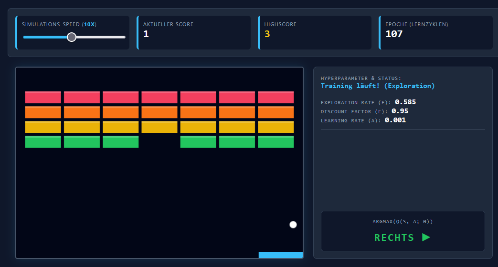

# 🧠 Arkanoid AI – Deep Q-Learning im Browser

Ein interaktives Machine Learning Experiment, bei dem eine Künstliche Intelligenz von Grund auf lernt, das klassische Atari-Spiel **Arkanoid** zu spielen. 

Die KI verwendet **Deep Reinforcement Learning (DQN)** und läuft dank **TensorFlow.js** vollständig lokal und in Echtzeit in deinem Webbrowser – ohne Backend oder serverseitiges Training.



## ✨ Features

* **Kein Hardcoding:** Die KI kennt weder die Spielregeln noch weiß sie, was ein Ball ist. Sie lernt alles selbstständig durch "Zuckerbrot und Peitsche" (Belohnung und Bestrafung).
* **Deep Q-Network (DQN):** Implementierung moderner DeepMind-Techniken wie *Experience Replay* und *Target Networks* für stabiles Lernen.
* **Turbo-Modus:** Ein Simulations-Slider erlaubt es, das Training auf bis zu 20-fache Geschwindigkeit zu beschleunigen, bei absolut flüssigen 60 FPS.
* **Live-Gehirn-Visualisierung:** Das Dashboard zeigt in Echtzeit den "Zustand" der KI, ihren Lernfortschritt (Epsilon) und ihre aktuelle Entscheidung.
* **Interaktives Lehrbuch:** Unter dem Spiel befindet sich eine detaillierte, leicht verständliche wissenschaftliche Dokumentation samt live gerenderter SVG des neuronalen Netzes und einem umfassenden KI-Lexikon.

## 🚀 Installation & Start

Dieses Projekt erfordert **kein Setup, keine Installation und keinen Build-Prozess**. 

1. Klone das Repository:
   ```bash
   git clone https://github.com/DEIN_USERNAME/arkanoid-ai.git
